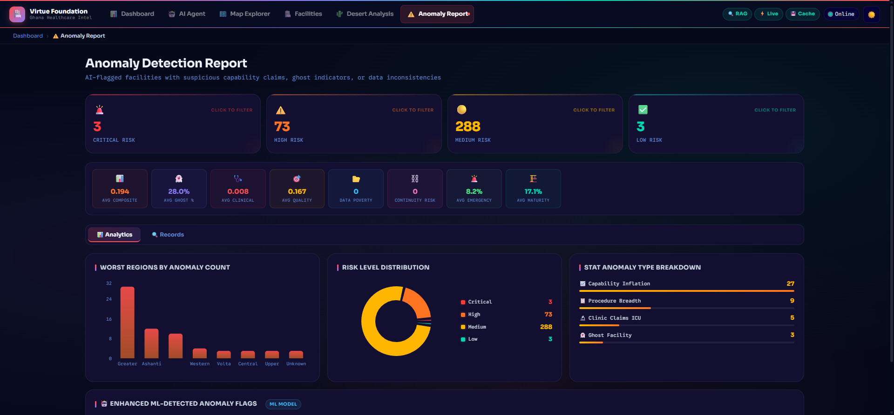
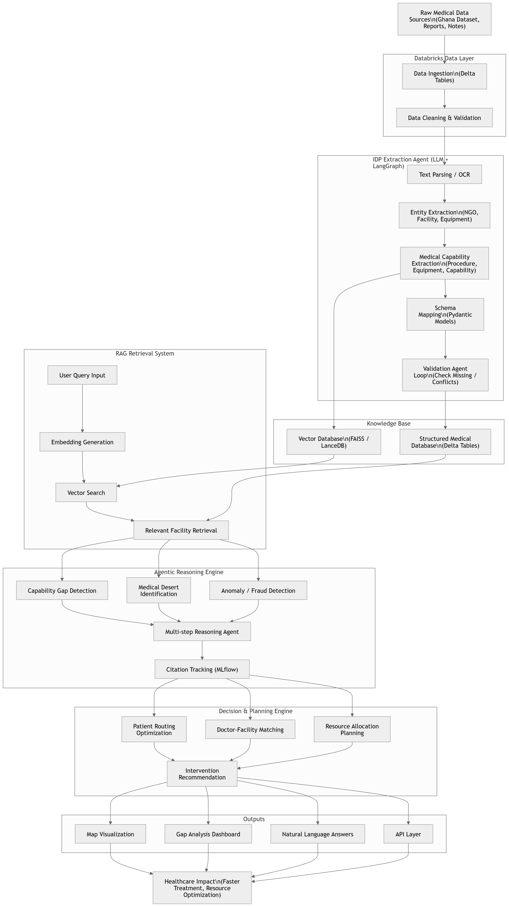

<div align="center">

<br/>


### *Bridging Medical Deserts with AI, Agentic Orchestration & Databricks*

<br/>

[](https://databricks.com)
[](https://fastapi.tiangolo.com)
[](https://react.dev)
[](https://langchain-ai.github.io/langgraph/)
[](https://python.org)

[](https://faiss.ai)
[](https://llama.meta.com)
[](https://mlflow.org)
[](https://vercel.com)
[](LICENSE)

<br/>

**[🚀 Live Demo](https://virtue-foundation-ghana-dd.vercel.app)** · **[📖 Architecture](#%EF%B8%8F-architecture--data-flow)** · **[🤖 Agent Docs](#-langgraph-14-node-agent)** · **[⚡ Quickstart](#-quickstart)**

> ⚠️ *Initial load may take ~2 min due to cold starts. Refresh once for optimal performance.*

</div>

---

## 🌍 What Is This?

The **Virtue Foundation Ghana Healthcare Intelligence Platform** is a next-generation, full-stack agentic AI system built for the **Databricks × Accenture Hackathon**. It transforms raw, unstructured healthcare facility data from across Ghana into a living, queryable intelligence layer — exposing critical medical deserts, data anomalies, staffing gaps, and intervention opportunities through a conversational AI agent and an interactive geospatial dashboard.

Designed for **NGO planners, clinicians, and data scientists**, the platform enables evidence-based healthcare resource allocation where it matters most.

---

## 📊 Pipeline Results at a Glance

<div align="center">

| Metric | Value |
|:---|---:|
| 🏥 Facilities Processed | **900+** |
| 🗺️ Ghana Regions Scored | **16** |
| ⚠️ Anomalies Flagged | **340+** |
| 🔴 Severe Medical Deserts | **2** (Savannah, Upper East) |
| 🟢 Adequate Coverage Regions | **5** (incl. Greater Accra, Eastern) |
| 🩺 Specialties Mapped | **30+** |
| 🧠 IDP Extraction Phases | **15** per record |
| 🤖 LangGraph Agent Nodes | **14** |
| 💬 MoSCoW Query Categories | **59** |
| 📐 Dashboard Views | **6** distinct pages |

</div>

---

## 🌵 Medical Desert Score Sample Output

<div align="center">

| Region | Label | MDS Score | Critical Gaps |
|:---|:---|:---:|:---|
| Savannah | 🔴 **Severe Desert** | `0.87` | Emergency Medicine · Surgery · Obstetrics · Pediatrics |
| Upper East | 🔴 **Severe Desert** | `0.84` | Emergency Medicine · Surgery · Obstetrics |
| Bono East | 🟡 **Moderate Desert** | `0.68` | General Surgery |
| Oti | 🟡 **Moderate Desert** | `0.71` | Pediatrics · Mental Health |
| Greater Accra | 🟢 **Adequate** | `0.39` | — |
| Eastern | 🟢 **Adequate** | `0.49` | — |

> **MDS (Medical Desert Score):** `0.0` = full coverage · `1.0` = complete healthcare desert

</div>

---

## 📸 Platform in Action

### 📊 Dashboard — Live KPI Intelligence
#### *Real-time KPI counters showing total facilities, hospitals, clinics, NGO partners, average Medical Desert Scores, and critical region counts across Ghana's 16 administrative regions.*


---

### 🗺️ Map Explorer — Geospatial Visualization
#### *Interactive Leaflet map with 900+ geocoded facility markers, medical desert heatmap overlays, regional boundary polygons, and facility detail popups with clinical capability badges.*


---

### 🌵 Desert Analysis — Regional Vulnerability Scoring
#### *Regional Medical Desert Scores (MDS) ranked by severity, with specialty gap breakdowns, bed-to-population ratio charts, and AI-generated recommended intervention actions.*


---

### ⚠️ Anomaly Report — Clinical Data Integrity
#### *Data integrity flags sorted by severity — automatically detecting impossible configurations such as clinics claiming ICU capabilities with zero doctors or no electricity supply.*


---

### 🤖 AI Agent — Real-Time Chat Interface
#### *Streaming chat panel with step-by-step reasoning timeline, dynamically generated SQL code display, document citations with confidence scores, and suggested query prompts.*


---

### 🏥 Facility Explorer — Searchable Registry
#### *Searchable and filterable registry of all 900+ healthcare facilities with clinical capability badges, infrastructure status, operator type classification, and geographic metadata.*


---

## ✨ Core Capabilities

### 🧠 Intelligent Document Parsing (IDP)
A **15-phase extraction pipeline** powered by **Llama-3 70B** via Databricks Model Serving. Splits entities into facilities vs. NGOs, parses free-form clinical narratives into structured arrays of procedures, equipment, and capabilities, then maps everything to 30+ standardized medical specialty categories.

### 🌵 Medical Desert Detection & Scoring
Computes a **Medical Desert Score (MDS)** per region based on bed counts, doctor-to-population ratios, specialty coverage, and infrastructure. Ranks all 16 Ghana regions from `0.0` (adequate) to `1.0` (severe desert) and surfaces actionable intervention recommendations.

### ⚠️ Anomaly Detection & Data Audit
Rule-based engine that cross-checks equipment claims against reported staffing and infrastructure. Flags implausible records (e.g., ICU claims with zero staff, surgical equipment without electricity) with severity labels and confidence scores.

### 🤖 Agentic Natural Language Interface
A compiled **14-node LangGraph StateGraph** routes every query through exactly the right combination of SQL, RAG, geospatial, and reasoning nodes — then synthesizes a unified answer with **row-level citations**, SQL trace, and confidence scores, streamed live via **Server-Sent Events (SSE)**.

### 🗺️ Interactive Geospatial Dashboard
React + Leaflet dashboard with **choropleth desert heatmaps**, geocoded facility markers, regional boundary layers, and facility detail popups — built for field planners who need spatial context.

### 🔁 Dual-Mode Retrieval (Databricks + FAISS)
Databricks Vector Search is the primary retrieval backend. A precomputed **local FAISS index** (`faiss_index.bin`) enables fully offline demos and production fallback with no code changes.

---

## 🛠️ Architecture & Data Flow

```
┌─────────────────────────────────────────────────────────────────────────────┐
│                           DATA INGESTION LAYER                              │
│                                                                             │
│   Raw CSVs ──┐                                                              │
│   GeoJSON   ─┼──► 01_ingest_bronze ──► bronze_facilities_raw (Delta)       │
│   Text PDFs ─┘                                                              │
└────────────────────────────────┬────────────────────────────────────────────┘
                                 │ ETL
                                 ▼
┌─────────────────────────────────────────────────────────────────────────────┐
│                         SILVER CLEANING LAYER                               │
│                                                                             │
│   02_transform_silver ──► silver_facilities_cleaned (Delta)                 │
│   (Dedup · Geo-parse · Standardize operators · Validate · E.164 phones)     │
└────────────────────────────────┬────────────────────────────────────────────┘
                                 │ Enrich
                                 ▼
┌─────────────────────────────────────────────────────────────────────────────┐
│                          GOLD ENRICHMENT LAYER                              │
│                                                                             │
│   03_build_gold ────────────────► gold_facilities_enriched                  │
│   04_idp_agent  (Llama-3 70B) ──► gold_idp_enriched                        │
│   07_desert_scoring ────────────► gold_medical_desert_scores                │
│   08_anomaly_detection ─────────► gold_anomaly_flags                        │
└──────────────┬──────────────────────────────┬───────────────────────────────┘
               │ Embed & Index                │ Query
               ▼                             ▼
┌──────────────────────────┐   ┌─────────────────────────────────────────────┐
│  Databricks Vector Search │   │              FastAPI Backend                │
│  Index (Primary RAG)      │   │  ┌───────────────────────────────────────┐ │
│                           │   │  │   LangGraph 14-Node StateGraph        │ │
│  + FAISS Local Fallback   │◄──┤  │   router → sql/rag/geo/anomaly/...    │ │
│  (faiss_index.bin)        │   │  │   → synthesiser → SSE stream          │ │
└──────────────────────────┘   │  └───────────────────────────────────────┘ │
                               │  Redis Cache · SQL Warehouse Connector      │
                               └─────────────────────┬───────────────────────┘
                                                     │ SSE / REST
                                                     ▼
                               ┌─────────────────────────────────────────────┐
                               │         React Frontend (Vite + TS)          │
                               │                                             │
                               │  📊 Dashboard  ·  🗺️ Map Explorer           │
                               │  🤖 AI Agent   ·  🏥 Facility Explorer      │
                               │  🌵 Desert Analysis  ·  ⚠️ Anomaly Report   │
                               └─────────────────────────────────────────────┘
```
---


---

## 🗄️ `databricks/notebooks/` — Deep Dive

The Databricks notebooks implement the full **Medallion Architecture** (Bronze → Silver → Gold), AI extraction, anomaly detection, and vector indexing pipelines. Every notebook is numbered to reflect its execution order.

### 🥉 Bronze Layer — Raw Ingestion

#### [`01_ingest_bronze_v2.ipynb`](databricks/notebooks/01_ingest_bronze_v2.ipynb)
- **Role**: Entry point for the entire data pipeline.
- **Input Sources**: Raw CSV facility registries, `ghana_facilities.geojson` boundary file, and unstructured free-text NGO reports.
- **Process**: Reads multi-format sources using PySpark, applies minimal schema enforcement, and writes as-is into Unity Catalog Delta Lake.
- **Output Table**: `virtue_foundation.ghana.bronze_facilities_raw`

---

### 🥈 Silver Layer — Cleaning & Standardization

#### [`02_transform_silver.ipynb`](databricks/notebooks/02_transform_silver.ipynb)
- **Role**: Data quality and standardization layer.
- **Process**:
  - Drops exact duplicate records using SHA hashing on key columns.
  - Parses and validates latitude/longitude coordinates — strips non-numeric artifacts, coerces to float.
  - Standardizes `region` names to match official Ghana administrative districts.
  - Formats telephone numbers to international E.164 standard.
  - Maps inconsistent operator names (e.g. "faith-based", "FBO", "religious") to canonical categories.
  - Handles null fields with configurable defaults per column type.
- **Output Table**: `virtue_foundation.ghana.silver_facilities_cleaned`

---

### 🥇 Gold Layer — Enrichment, Scoring & AI Extraction

#### [`03_build_gold.ipynb`](databricks/notebooks/03_build_gold.ipynb)
- **Role**: Geospatial enrichment and administrative boundary mapping.
- **Process**: Performs a geospatial join using facility `lat/lon` coordinates against the GeoJSON polygon collection to determine the official `region`, `district`, and `sub-district` for every record.
- **Output Table**: `virtue_foundation.ghana.gold_facilities_enriched`

#### [`04_idp_agent.ipynb`](databricks/notebooks/04_idp_agent.ipynb) · [`04_idp_agent.py`](databricks/notebooks/04_idp_agent.py)
- **Role**: Core **Intelligent Document Processing (IDP)** engine. The most complex notebook in the pipeline.
- **Process** — 15-phase extraction pipeline powered by **Llama-3 70B** via `ai_query()`:
  1. **Entity Classification**: Splits records into `facility`, `ngo`, or `other_organization`.
  2. **Free-Form Parsing**: Extracts unstructured paragraphs into `procedures[]`, `equipment[]`, and `capabilities[]` arrays.
  3. **Specialty Ontology Mapping**: Maps extracted procedures (e.g. `"cesarean section"`) to 30+ standardized medical specialty codes (e.g. `gynecologyAndObstetrics`).
  4. **Null-Fill Batching**: Clusters missing attributes (email, website, founding year) and resolves them in a single batched LLM call.
  5. **Confidence Scoring**: Assigns an extraction confidence score to each enriched record.
- **Execution Mode**: Uses `ThreadPoolExecutor` with 12 parallel threads for concurrent model serving calls.
- **Output Table**: `virtue_foundation.ghana.gold_idp_enriched`

#### [`07_medical_desert_scoring.ipynb`](databricks/notebooks/07_medical_desert_scoring.ipynb)
- **Role**: Healthcare accessibility vulnerability calculator.
- **Process**: Computes a composite **Medical Desert Score (MDS v12)** per region using:
  - `density_component`: Facilities and hospitals per 100k population.
  - `specialty_component`: Weighted score based on presence/absence of 10 critical specialties.
  - `integrity_component`: Penalizes low data quality and high anomaly rates.
  - `confidence_component`: Adjusts score based on completeness of source data.
  - Final `blended_mds`: Weighted average of all four components (v12 algorithm).
- **Output**: Desert label categories: `Severe Desert`, `Moderate Desert`, `Marginal`, `Adequate`.
- **Output Table**: `virtue_foundation.ghana.gold_medical_desert_scores`

#### [`08_anomaly_detection_v2.ipynb`](databricks/notebooks/08_anomaly_detection_v2.ipynb)
- **Role**: Clinical plausibility and data integrity auditor.
- **Process**: Evaluates 20+ rule-based checks including:
  - ICU beds reported with zero clinical staff.
  - Surgical capabilities claimed without anaesthesia equipment.
  - Advanced diagnostics reported without electricity infrastructure.
  - Hospital beds count exceeding documented room capacity by >10×.
  - Coordinates outside Ghana's geographic bounding box.
- **Output Table**: `virtue_foundation.ghana.gold_anomaly_flags`

---

### 🔍 RAG Indexing & Agent Prototyping

#### [`05_rag_build_index.ipynb`](databricks/notebooks/05_rag_build_index.ipynb)
- **Role**: Semantic search index builder.
- **Process**:
  - Generates vector embeddings from facility descriptions, clinical narratives, and capability summaries using a Databricks BGE embedding endpoint.
  - Synchronizes embeddings to a **Databricks Vector Search Index** on `gold_idp_enriched`.
  - Simultaneously writes a local **FAISS index** (`faiss_index.bin`) and metadata (`faiss_metadata.json`) to `backend/rag_data/` as an offline fallback.
- **Output**: Live Databricks VS index + local FAISS binary files.

#### [`06_langgraph_agent.ipynb`](databricks/notebooks/06_langgraph_agent.ipynb)
- **Role**: Development prototyping workspace.
- **Purpose**: Used to design and test LangGraph node logic, intent classification routing, and tool validation before porting to the FastAPI backend.

---

### 🐍 Supporting IDP Helper Modules

| Module | Role |
|:---|:---|
| [`organization_extraction.py`](databricks/notebooks/organization_extraction.py) | LLM prompts + Pydantic models for entity classification (Facility / NGO / Other) |
| [`facility_and_ngo_fields.py`](databricks/notebooks/facility_and_ngo_fields.py) | `FieldSpec` registry defining extraction prompts for 50+ facility/NGO attributes |
| [`free_form.py`](databricks/notebooks/free_form.py) | Parsers for raw clinical narratives, free-text paragraphs, and on-the-ground field notes |
| [`medical_specialties.py`](databricks/notebooks/medical_specialties.py) | Procedure-to-specialty ontology mapper covering 30+ specialty codes |

---

## ⚙️ `backend/` — Deep Dive

The FastAPI backend acts as the intelligence layer between the Databricks data platform and the React frontend. It operates in **Hybrid Live + Fallback mode** — using Databricks when available, and automatically switching to local FAISS and CSV datasets when offline.

---

### 📁 Root Configuration Files

| File | Role | Description |
|:---|:---|:---|
| [`main.py`](backend/main.py) | **Entry bootstrapper** | Appends `app/` to Python path and launches the Uvicorn ASGI server |
| [`Dockerfile`](backend/Dockerfile) | **Container config** | Multi-stage Docker image for production deployment |
| [`app.yaml`](backend/app.yaml) | **GCP/Render deploy config** | Host, port, environment variable bindings for cloud VM hosting |
| [`render.yaml`](backend/render.yaml) | **Render.com deploy** | Service configuration for Render free-tier backend hosting |
| [`requirements.txt`](backend/requirements.txt) | **Dependencies** | All Python dependencies: `fastapi`, `langgraph`, `databricks-sql-connector`, `faiss-cpu`, `redis`, `structlog`, and more |
| [`.env.example`](backend/.env.example) | **Config template** | Template for all required environment variables with inline documentation |

---

### 📁 `backend/app/` — FastAPI Application Core

#### [`app/main.py`](backend/app/main.py)
- Initializes the FastAPI application instance.
- Configures CORS middleware to allow requests from the React frontend (Vercel + localhost).
- Registers all API routers under versioned path prefixes.
- Hooks `startup` and `shutdown` lifecycle events that initialize Databricks connections, load FAISS indexes, and warm Redis caches.

---

### 📁 `backend/app/core/` — Configuration & Database

| File | Role | Description |
|:---|:---|:---|
| [`core/config.py`](backend/app/core/config.py) | **Settings loader** | Reads all environment variables using Pydantic `BaseSettings`; provides typed config objects for Databricks tokens, FAISS paths, Redis URLs, CORS origins, and model endpoints |
| [`core/database.py`](backend/app/core/database.py) | **SQLite init** | Initializes a local SQLite database for persistent session and chat history storage when Redis is unavailable |

---

### 📁 `backend/app/api/` — REST API Routers

Each file registers one or more FastAPI router endpoints exposed to the React frontend:

| File | Endpoint(s) | Description |
|:---|:---|:---|
| [`api/agent.py`](backend/app/api/agent.py) | `POST /api/v1/agent/query` | **Primary AI chat endpoint.** Accepts natural-language queries and streams responses via Server-Sent Events (SSE). Each SSE event represents one reasoning step: intent classification, SQL execution, RAG retrieval, or synthesized answer with citations. |
| [`api/facilities.py`](backend/app/api/facilities.py) | `GET /api/v1/facilities` | Returns geocoded facility list with coordinates, facility type, operator, region, and clinical capability metadata for Leaflet map rendering. |
| [`api/regions.py`](backend/app/api/regions.py) | `GET /api/v1/regions/summary` `GET /api/v1/regions/desert-scores` | Serves region polygon shapes and computed MDS values for choropleth heatmap rendering. |
| [`api/anomalies.py`](backend/app/api/anomalies.py) | `GET /api/v1/anomalies` | Returns flagged data inconsistencies from `gold_anomaly_flags` with severity labels and source attribution. |
| [`api/exports.py`](backend/app/api/exports.py) | `GET /api/v1/exports/facilities` | Streams analytical results as downloadable CSV documents. |
| [`api/health.py`](backend/app/api/health.py) | `GET /health` | Returns Databricks warehouse status, FAISS index load status, Redis connectivity, and SQL health check results. |

---

### 📁 `backend/app/agents/` — LangGraph AI Orchestrator

This is the intelligence core of the platform — a compiled **14-node LangGraph StateGraph**:

| File | Role | Description |
|:---|:---|:---|
| [`agents/graph.py`](backend/app/agents/graph.py) | **Graph compiler** | Registers all 14 nodes, defines conditional routing edges (`_route_after_router`, `_route_after_sql`, `_route_after_rag`), sets the entry point to `router`, and compiles the stateful `VIRTUE_AGENT` at module startup. |
| [`agents/state.py`](backend/app/agents/state.py) | **State schema** | Defines the `AgentState` TypedDict carrying the full conversation context across nodes: `query`, `chat_history`, `sub_agents`, `sql_results`, `rag_results`, `geo_results`, `anomaly_results`, `desert_results`, `answer`, `citations`, `step_citations`, `errors`, and more. |
| [`agents/nodes.py`](backend/app/agents/nodes.py) | **Node implementations** | The largest file in the project (61KB). Contains Python functions for all 14 agent nodes: SQL generation and execution, FAISS/Vector Search retrieval, Haversine geo calculations, anomaly lookups, desert score interpretation, NGO gap analysis, workforce analysis, and the final synthesiser that builds the structured response. |
| [`agents/prompts.py`](backend/app/agents/prompts.py) | **System prompts** | 40KB of carefully engineered prompt templates: router classification prompt, SQL generation system prompt with schema injection, RAG synthesis instructions, clinical reasoning guidelines, planning frameworks, and error recovery instructions. |
| [`agents/web_search.py`](backend/app/agents/web_search.py) | **Web search node** | Implements the `web_search_node` that queries public web sources (WHO guidelines, disease statistics) when the user enables the web toggle. |
| [`agents/utils.py`](backend/app/agents/utils.py) | **Shared utilities** | Helper functions for text cleaning, string truncation, result formatting, and safe JSON parsing used across multiple node implementations. |

---

### 📁 `backend/app/services/` — Integration Services

| File | Role | Description |
|:---|:---|:---|
| [`services/agent_service.py`](backend/app/services/agent_service.py) | **SSE orchestrator** | Bridges FastAPI and LangGraph. Runs the compiled graph in a background `ThreadPoolExecutor` thread to prevent blocking the async event loop. Transforms each graph state update into structured SSE events (`step`, `answer`, `citations`, `error`) streamed to the frontend. |
| [`services/sql_service.py`](backend/app/services/sql_service.py) | **Databricks SQL connector** | The largest service file (41KB). Manages connection pooling to the Databricks SQL Warehouse via `databricks-sql-connector`. Implements: Redis query result caching with configurable TTL, SQL safety validation (blocks all DDL/DML keywords: `DROP`, `DELETE`, `ALTER`, `TRUNCATE`, `CREATE`, `INSERT`, `UPDATE`), and async-safe query execution with retry logic. |
| [`services/faiss_service.py`](backend/app/services/faiss_service.py) | **FAISS fallback manager** | Loads and manages the local FAISS vector index (`faiss_index.bin`) and metadata (`faiss_metadata.json`). Implements multi-tier embedding fallback: tries OpenAI-compatible payload first, then reformats to MLflow dataframe records if rejected. Queries the FAISS index for nearest-neighbor document retrieval with configurable `top_k`. |
| [`services/cache_service.py`](backend/app/services/cache_service.py) | **Redis wrapper** | Async-safe Redis client with connection health checking, TTL management, key namespacing, JSON serialization/deserialization, and graceful fallback to in-memory dict if Redis is unavailable. |
| [`services/chat_history_service.py`](backend/app/services/chat_history_service.py) | **Conversation memory** | Stores and retrieves multi-turn conversation logs by `session_id`. Supports Redis-backed persistence with SQLite fallback for offline mode. |

---

## 🤖 LangGraph 14-Node Agent

The conversational agent is a compiled **LangGraph StateGraph** that routes every query through exactly the right combination of nodes.

```
User Query
    │
    ▼
┌─────────┐
│  router │ ──── classifies intent ────────────────────────────────────────┐
└─────────┘                                                                 │
    │                                                                       │
    ├──► sql_query         (SQL gen + Databricks Warehouse execution)       │
    ├──► rag_search         (Databricks Vector Search / FAISS fallback)     │
    ├──► geo_calc           (Haversine proximity radius filter)             │
    ├──► anomaly_check      (gold_anomaly_flags retrieval)                  │
    ├──► desert_check       (MDS fetch + regional interpretation)           │
    ├──► medical_reason     (Clinical gap analysis + risk narrative)        │
    ├──► planning_sys       (NGO intervention plan drafting)                │
    ├──► ngo_search         (NGO registry + coverage gap mapping)           │
    ├──► workforce_analysis (Doctor/nurse/specialist distribution)          │
    ├──► resource_check     (Scarce procedures, single-point-of-failure)    │
    ├──► validation_check   (Equipment vs. staffing cross-check)            │
    └──► web_search         (WHO guidelines + external public data)         │
                                                                            │
                        All dispatched nodes complete                       │
                                 │                                          │
                                 ▼                                          │
                          ┌────────────┐ ◄──────────────────────────────── ┘
                          │ synthesiser│  merges outputs + builds citations
                          └─────┬──────┘  + confidence scores + SQL trace
                                │
                                ▼ SSE stream
                          FINAL ANSWER
```

### Full Node Reference

| Node | Role | Responsibility |
|:---|:---|:---|
| `router` | Entry Point | Classifies intent; builds ordered dispatch list (1–3 nodes) |
| `sql_query` | SQL Generator | Generates safe read-only SQL, validates, executes on Databricks SQL Warehouse |
| `rag_search` | Vector Search | Queries Databricks Vector Search or FAISS fallback for document passages |
| `geo_calc` | Geo Proximity | Haversine distance filtering for facilities within radius of a named location |
| `anomaly_check` | Anomaly Audit | Retrieves flagged data inconsistencies and evaluates severity |
| `desert_check` | Desert Scorer | Fetches and interprets Medical Desert Scores for queried regions |
| `medical_reason` | Clinical Reasoning | Clinical analysis of healthcare needs and specialist gaps |
| `planning_sys` | Action Planner | Drafts NGO intervention plans and specialist deployment recommendations |
| `ngo_search` | NGO Mapper | Finds NGOs operating in regions; identifies coverage gaps |
| `workforce_analysis` | Staff Analyser | Analyses doctor, nurse, and specialist workforce distribution |
| `resource_check` | Resource Auditor | Identifies scarce procedures and single-point-of-failure facilities |
| `validation_check` | Data Validator | Cross-checks equipment claims against staffing and infrastructure |
| `web_search` | External Search | Fetches WHO guidelines and public data to supplement internal datasets |
| `synthesiser` | Response Builder | Merges all node outputs into a single answer with citations and confidence scores |

---

## 💬 Sample Agent Queries

> **"Which region in Ghana has the fewest doctors per capita?"**
> ```
> → router → sql_query → synthesiser
> → Savannah (0.00 doctors/100k) — recommended actions: deploy 3 GPs, 1 surgeon
> ```

> **"Find all clinics within 50km of Kumasi with surgical capability"**
> ```
> → router → geo_calc + rag_search → synthesiser
> → 7 facilities matched · sorted by distance · confidence scores attached
> ```

> **"Which facilities report ICU beds but have zero doctors?"**
> ```
> → router → sql_query + anomaly_check → synthesiser
> → 12 flagged records from gold_anomaly_flags · severity: CRITICAL
> ```

> **"What is the maternal mortality risk in Upper East region?"**
> ```
> → router → desert_check + medical_reason → synthesiser
> → MDS obstetrics gap: 0.84 · narrative: high-risk, 0 OB/GYN specialists within region
> ```

> **"Which NGOs are active in Savannah and what gaps remain?"**
> ```
> → router → ngo_search + rag_search → synthesiser
> → 2 NGOs matched · 4 specialty gaps identified · intervention plan drafted
> ```

---

## 🖥️ Dashboard Pages

| Page | Icon | File | Description |
|:---|:---:|:---|:---|
| Dashboard | 📊 | `Dashboard.tsx` | Live KPI counters: facilities, hospitals, NGO partners, average MDS, critical desert counts |
| Map Explorer | 🗺️ | `MapExplorer.tsx` | Leaflet map with desert heatmaps, facility markers, regional boundaries, and detail popups |
| Desert Analysis | 🌵 | `DesertAnalysis.tsx` | Regional MDS rankings, specialty gap breakdowns, bed/doctor ratio charts, intervention actions |
| Anomaly Report | ⚠️ | `AnomalyReport.tsx` | Data integrity flags sorted by severity, with inconsistency detail and source attribution |
| AI Agent | 🤖 | `ChatAgent.tsx` | Real-time streaming chat: step-by-step reasoning, SQL display, citations, confidence scores |
| Facility Explorer | 🏥 | `FacilityExplorer.tsx` | Searchable, filterable registry of 900+ facilities with capability badges and geo metadata |

---

## 📐 Tech Stack

<div align="center">

| Layer | Technology | Purpose |
|:---|:---:|:---|
| **Data Engineering** |  | Medallion pipeline, Unity Catalog, Delta Lake |
| **LLM Extraction** |  | IDP entity & fact extraction via `ai_query` |
| **Vector Search** |  | Semantic RAG retrieval with offline fallback |
| **Agent Orchestration** |  | 14-node stateful agent state machine |
| **Backend API** |  | SSE streaming, REST endpoints, Redis caching |
| **Frontend** |  | Vite + TypeScript dashboard |
| **Maps** |  | Interactive geospatial heatmaps |
| **Caching** |  | Query result caching, TTL management |
| **Deployment** |  +  | Frontend CDN + Backend containerization |

</div>

---

## ⚡ Quickstart

### Prerequisites
- Python 3.11+ · Node.js 18+ · Git

### Backend

```bash
git clone https://github.com/your-username/virtue-foundation-ghana.git
cd virtue-foundation-ghana/backend

cp .env.example .env          # fill in Databricks credentials
python -m venv .venv
source .venv/bin/activate     # Windows: .\.venv\Scripts\Activate.ps1
pip install -r requirements.txt

uvicorn app.main:app --reload --port 8000
# API running at http://localhost:8000
# Health check: http://localhost:8000/health
```

### Frontend

```bash
cd ../frontend
npm install
npm run dev
# Dashboard at http://localhost:5173
```

### Docker (Full Stack)

```bash
cd backend
docker build -t virtue-backend .
docker run -p 8000:8000 --env-file .env virtue-backend
```

### Databricks Asset Bundle (DAB)

```bash
pip install databricks-cli
databricks configure --token

# Deploy to dev
databricks bundle deploy --target dev
databricks bundle run virtue_foundation_idp --target dev

# Deploy to production
databricks bundle deploy --target prod
databricks bundle run virtue_foundation_idp --target prod
```

| Target | App Name | Workspace |
|:---|:---|:---|
| `dev` | `virtue-foundation-idp-dev` | `https://dbc-147ceb0b-b41d.cloud.databricks.com` |
| `prod` | `virtue-foundation-idp` | Same workspace — production mode enabled |

---

## ⚙️ Environment Variables

```env
# Databricks Connection
DATABRICKS_HOST=https://your-workspace.cloud.databricks.com
DATABRICKS_TOKEN=dapiXXXXXXXXXXXXXXXX
DATABRICKS_HTTP_PATH=/sql/1.0/warehouses/your-warehouse-id
DATABRICKS_CATALOG=virtue_foundation
DATABRICKS_SCHEMA=ghana

# Databricks Model Serving
LLM_ENDPOINT=databricks-meta-llama-3-3-70b-instruct
EMBED_ENDPOINT=databricks-bge-large-en

# Application
SECRET_KEY=your-secret-key-here
CORS_ORIGINS=https://your-frontend.vercel.app,http://localhost:5173

# Optional: Redis Caching
REDIS_URL=redis://localhost:6379

# Optional: FAISS Fallback
FAISS_INDEX_URL=https://your-storage.com/faiss_index.bin
FAISS_META_URL=https://your-storage.com/faiss_metadata.json

# Optional: MLflow Tracing
MLFLOW_TRACKING_URI=databricks
```

> 🔒 **Security:** Never commit real tokens. Use platform secret management in production. Rotate any exposed credentials immediately.

---

## 🔐 Security & Governance

### Unity Catalog Governance
- Row-level and column-level access controls
- Dataset lineage tracking
- Secure Delta Sharing

### Secure Query Execution
- Read-only SQL validation
- Blocks all DDL/DML operations
- Parameterized query enforcement

### Infrastructure Security
- Environment-variable secret management
- Token-based Databricks authentication
- Redis connection isolation
- CORS-restricted API access

### Healthcare Data Safety
- No patient PII stored
- Synthetic/anonymized datasets only
- Secure in-platform AI extraction using Databricks Foundation Models

---

## 🩺 API Reference

<div align="center">

| Method | Endpoint | Description |
|:---|:---|:---|
| `GET` | `/health` | Databricks + FAISS connectivity status |
| `GET` | `/api/v1/regions/summary` | Region-level summary metrics |
| `GET` | `/api/v1/facilities` | Geocoded facility list with coordinates |
| `GET` | `/api/v1/regions/desert-scores` | Medical Desert Scores per region |
| `GET` | `/api/v1/anomalies` | Data integrity anomaly flags |
| `POST` | `/api/v1/agent/query` | SSE-streaming natural language agent query |
| `GET` | `/api/v1/exports/facilities` | Download facilities as CSV |

</div>

---

## 🏗️ Project Structure

```
virtue-foundation-ghana/
│
├── databricks/
│   └── notebooks/                  # Medallion ETL · IDP · RAG · Scoring
│       ├── 01_ingest_bronze_v2.ipynb       ← Raw CSV/GeoJSON/text ingestion
│       ├── 02_transform_silver.ipynb       ← Dedup, standardize, geo-parse
│       ├── 03_build_gold.ipynb             ← Geospatial join with boundaries
│       ├── 04_idp_agent.ipynb              ← 15-phase Llama-3 IDP extraction
│       ├── 04_idp_agent.py                 ← Python source version of IDP
│       ├── 05_rag_build_index.ipynb        ← Embed + sync VS index + FAISS
│       ├── 06_langgraph_agent.ipynb        ← Agent prototype sandbox
│       ├── 07_medical_desert_scoring.ipynb ← MDS v12 composite scoring
│       ├── 08_anomaly_detection_v2.ipynb   ← Clinical plausibility audit
│       ├── organization_extraction.py      ← Entity classification prompts
│       ├── facility_and_ngo_fields.py      ← FieldSpec extraction registry
│       ├── free_form.py                    ← Narrative parser
│       └── medical_specialties.py          ← Procedure-to-specialty mapper
│
├── backend/                        # FastAPI application
│   ├── app/
│   │   ├── api/                    # Route handlers
│   │   │   ├── agent.py            ← SSE agent query endpoint
│   │   │   ├── facilities.py       ← Geocoded facility data
│   │   │   ├── regions.py          ← MDS + polygon data
│   │   │   ├── anomalies.py        ← Data integrity flags
│   │   │   ├── exports.py          ← CSV download
│   │   │   └── health.py           ← System status
│   │   ├── agents/                 # LangGraph orchestrator
│   │   │   ├── graph.py            ← 14-node StateGraph compiler
│   │   │   ├── nodes.py            ← All node implementations (61KB)
│   │   │   ├── state.py            ← AgentState TypedDict schema
│   │   │   ├── prompts.py          ← System prompt library (40KB)
│   │   │   ├── web_search.py       ← External search node
│   │   │   └── utils.py            ← Shared helpers
│   │   ├── services/               # External integrations
│   │   │   ├── agent_service.py    ← FastAPI ↔ LangGraph SSE bridge
│   │   │   ├── sql_service.py      ← Databricks SQL Warehouse (41KB)
│   │   │   ├── faiss_service.py    ← FAISS fallback manager
│   │   │   ├── cache_service.py    ← Redis wrapper
│   │   │   └── chat_history_service.py ← Conversation memory
│   │   └── core/
│   │       ├── config.py           ← Pydantic Settings loader
│   │       └── database.py         ← SQLite init for offline mode
│   ├── rag_data/                   ← faiss_index.bin + faiss_metadata.json
│   ├── static/                     ← Static assets
│   ├── tests/                      ← Backend test suite
│   ├── Dockerfile
│   ├── requirements.txt
│   └── main.py
│
├── frontend/                       # React SPA (Vite + TypeScript)
│   ├── src/
│   │   ├── pages/
│   │   │   ├── Dashboard.tsx       ← KPI counters + region charts
│   │   │   ├── MapExplorer.tsx     ← Leaflet heatmap + facility markers
│   │   │   ├── ChatAgent.tsx       ← SSE streaming agent chat
│   │   │   ├── FacilityExplorer.tsx← Searchable facility registry
│   │   │   ├── DesertAnalysis.tsx  ← MDS ranking + specialty gaps
│   │   │   └── AnomalyReport.tsx   ← Data integrity flags
│   │   └── api/
│   │       └── client.ts           ← Unified fetch wrappers + SSE consumer
│   └── public/                     ← GIFs, screenshots, favicon
│
├── databricks.yml                  ← Asset Bundle config (dev + prod)
├── cluster_config.json             ← DBR 14.3 LTS cluster specification
└── job_serverless.json             ← Serverless workflow job definition
```

---

## 🏆 Hackathon Evaluation Alignment

| Criterion | How This Project Delivers |
|:---|:---|
| **Technical Innovation** | LLM-powered IDP with 15-phase extraction using Databricks `ai_query` natively in Delta tables |
| **Databricks Platform Depth** | Unity Catalog · Delta Lake Medallion · Vector Search · Model Serving · SQL Warehouse · DAB deployment |
| **Social Impact** | Directly addresses WHO SDG 3 (health equity) by identifying medical deserts and enabling NGO resource allocation |
| **Data Quality** | Automated anomaly detection engine flags 340+ contradictions across 900+ facilities |
| **UX & Accessibility** | Natural-language agent enables non-technical planners to query complex datasets without SQL knowledge |
| **Production Readiness** | Docker · Redis caching · FAISS offline fallback · SSE streaming · DAB multi-environment deployment |

---

## 🌍 Real-World Healthcare Impact

This platform directly supports:
- NGO intervention planning
- Rural healthcare accessibility analysis
- Clinical workforce allocation
- Medical infrastructure auditing
- Regional vulnerability assessment
- Public health intelligence operations

Potential deployment scenarios include:
- Ministry of Health planning
- WHO regional healthcare analytics
- Emergency response coordination
- Rural maternal healthcare outreach
- NGO funding prioritization

---

## 🗺️ Roadmap

- [ ] MLflow trace links per agent sub-step for full observability
- [ ] Automated extraction accuracy tests + end-to-end SSE stream tests
- [ ] Expanded map overlays: population density, road access index
- [ ] Multi-country support beyond Ghana
- [ ] Fine-tuned embedding model for clinical terminology
- [ ] Mobile-responsive PWA for field NGO workers

---

## 🛡️ License & IP Compliance

<details>
<summary><b>View full license table</b></summary>

| Component | License |
|:---|:---|
| FastAPI | MIT License |
| LangGraph | MIT License |
| Databricks SQL Connector | Apache License 2.0 |
| FAISS | MIT License |
| React & Vite | MIT License |
| Leaflet.js | BSD 2-Clause License |
| Meta Llama-3 (via Databricks serving) | Meta Llama 3 Community License |
| GeoJSON boundary data | Public domain / CC-BY (humanitarian open data) |
| Facility records & NGO profiles | Synthetic / anonymized — zero PII |

All pipeline notebooks, scoring algorithms, LangGraph node logic, FastAPI services, and React UI components were authored specifically for this hackathon submission and are free of copyright infringement.

</details>

---

## 🤝 Acknowledgements

<div align="center">

Built with ❤️ for the **Databricks × Accenture Hackathon 2025**

| | |
|:---:|:---|
| 🏥 | **Virtue Foundation** — for the vision, mission, and data |
| ⚡ | **Databricks** — for the Data Intelligence Platform powering this solution |
| 🤝 | **Accenture** — for the hackathon track and challenge framing |
| 🌍 | **Open Source Community** — React · FastAPI · Leaflet · FAISS · LangGraph |

</div>

---

<div align="center">

**Built with purpose for the Databricks × Accenture Virtue Foundation Hackathon**

*Making healthcare access visible — one data point at a time.* 🇬🇭

[](https://virtue-foundation-ghana-dd.vercel.app)

</div>
